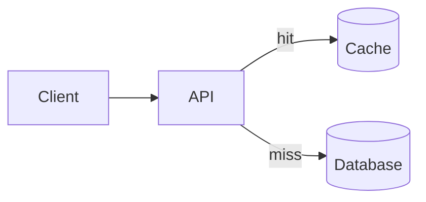

# Caching strategy for the catalog API

The catalog API spends 70% of request time on repeated product lookups. This document compares three caching
options. **Recommendation: Redis**, because it is shared across all instances and survives deploys.

## Options

| Option         | Shared across instances | Survives deploy | Operational cost    |
| -------------- | ----------------------- | --------------- | ------------------- |
| Redis          | Yes                     | Yes             | New managed service |
| In-process LRU | No                      | No              | None                |
| CDN edge cache | Yes                     | Yes             | Cache purge tooling |

## Risks

- **Stale data**: product prices change several times a day. Each option needs an invalidation story.
- **Latency**: Redis adds a network hop of about 1 ms per lookup.
- **Cold start**: in-process caches start empty after every deploy.

## Rollout

Ship behind a feature flag, enable for 10% of traffic, and compare p95 latency for one week.
